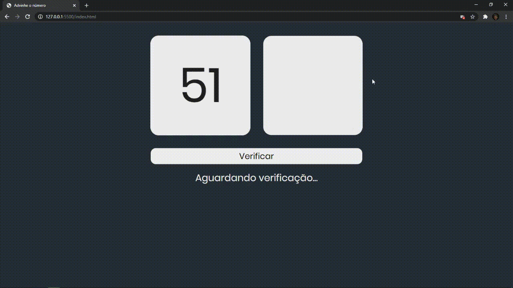

_English_

# What Number
❓ Guess the proposed number

💡 A simple number check I did to test my new knowledge in the javascript language

`Web preview`


## 🕹 Deployment in
https://devgabrieldejesus.github.io/what-number/

## 📈 Example usage

This check can be used in a registration form for example to do the filtering of robots leaving only human beings to move on to the next phase.

## 💻 Configuration for Development

Windows:

You can clone the repository through CMD (Command Prompt) just by typing:
```sh
git clone https://github.com/devgabrieldejesus/what-number
```

or download the zip from the green button at the beginning of the repository


## 🗃 Release history

* 0.1.0
    * Project finalized and studying the possibility of adding new resources
    * The first suitable launch
* 0.0.1
    * Work in progress

## 📝 Meta

Gabriel de Jesus – [My portfolio](https://www.gabrieldesenvolvedor.com/) – oi@gabrieldesenvolvedor.com

Distributed under the MIT License. See `LICENSE` for more information.

[https://github.com/devgabrieldejesus/what-number](https://github.com/devgabrieldejesus/)

## 🚀 Contributing

1. Fork it (<https://github.com/devgabrieldejesus/what-number/fork>)
2. Create your feature branch (`git checkout -b feature/fooBar`)
3. Commit your changes (`git commit -am 'Add some fooBar'`)
4. Push to the branch (`git push origin feature/fooBar`)
5. Create a new Pull Request

---

_Português_

# Qual o número?
❓ Adivinhe o número proposto

💡 Uma verificação numérica simples que fiz para testar meus novos conhecimentos na linguagem javascript

`Visualização da Web`


## 🕹 Teste aqui
https://devgabrieldejesus.github.io/what-number/

## 📈 Exemplo de uso

Esta verificação pode ser usada em um formulário de registro por exemplo para fazer a filtragem de robôs deixando apenas seres humanos para seguir para a próxima fase.

## 💻 Configuração para Desenvolvimento

Windows:

Você pode clonar o repositório por meio do CMD (Prompt de Comando) apenas digitando:
```sh
git clone https://github.com/devgabrieldejesus/what-number
```

ou baixe o zip no botão verde no início do repositório


## 🗃 Histórico de lançamento

* 0.1.0
    * Projeto finalizado e estudando a possibilidade de agregar novos recursos
    * O primeiro lançamento adequado
* 0.0.1
    * Trabalho em progresso

## 📝 Meta

Gabriel de Jesus - [Meu portfólio](https://www.gabrieldesenvolvedor.com/) - oi@gabrieldesenvolvedor.com

Distribuído sob a licença MIT. Veja `LICENSE` para mais informações.

[https://github.com/devgabrieldejesus/what-number](https://github.com/devgabrieldejesus/)

## 🚀 Contribuição

1. Fork it (<https://github.com/devgabrieldejesus/what-number/fork>)
2. Crie seu branch de recurso (`git checkout -b feature / fooBar`)
3. Faça commit de suas alterações (`git commit -am 'Add some fooBar'`)
4. Empurre para o branch (`git push origin feature / fooBar`)
5. Crie uma nova solicitação pull
